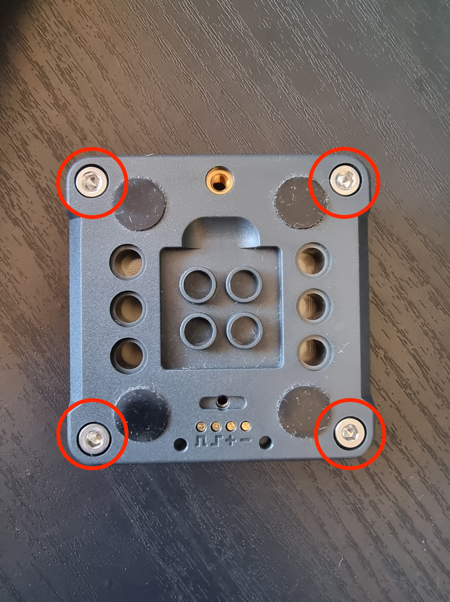
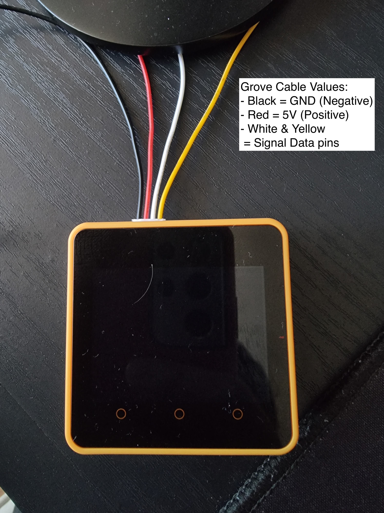
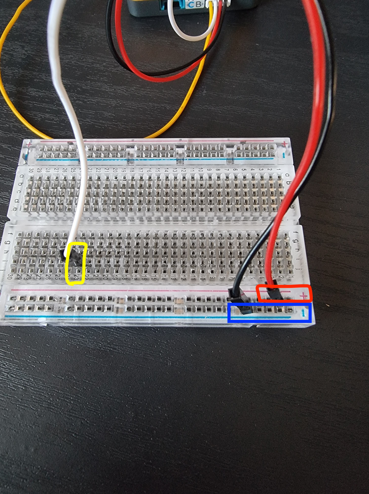
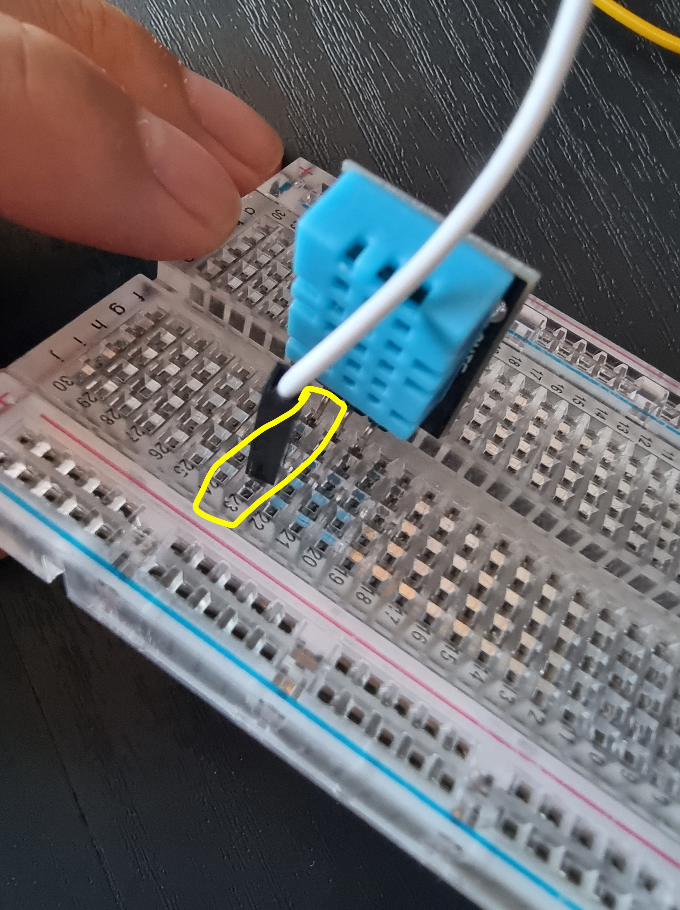
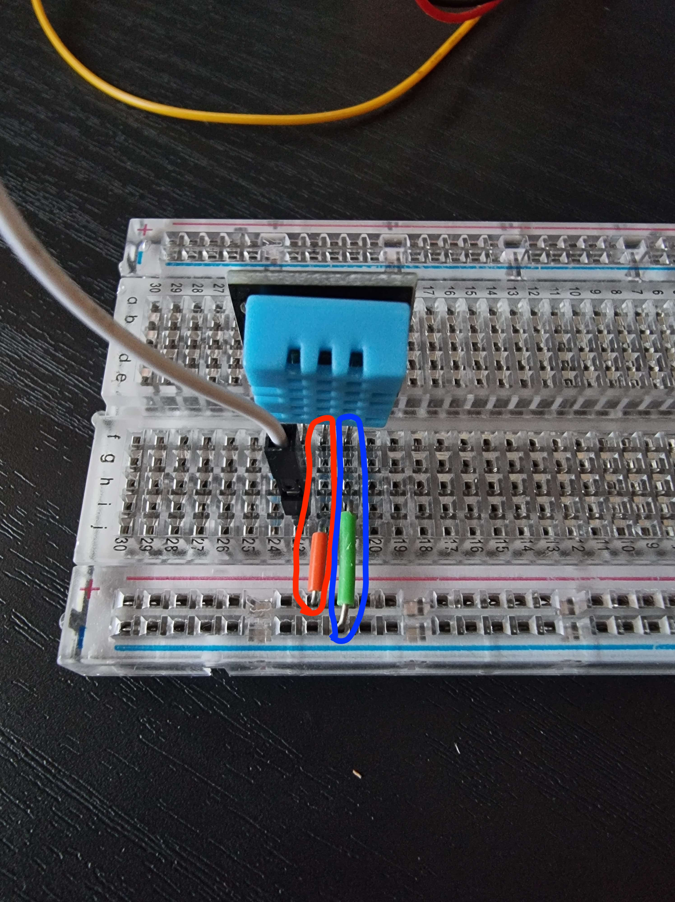

# Base example

The following sample how to connect the DHT11 to the Edukit M5 Stack Core 2 device. Note that this example will be specific for the DHT11 temperature sensor and all instructions are recommended instructions for starting out with the sensor.

***

## What you need:

- 1x Breadboard
- 1x Edukit Device
- 1x DHT11 Temperature/Humidity Sensor
- 1x Grove connector (4 pin)
- 1x Jumper wires kit

***

1. Grab the Edukit device and make sure the top and bottom parts are secured to each other (the 4 screws should be fastened to the device)

2. Grab the grove connector cable and connect the connector's female port into PORT B of the Edukit device. Port B is the top left port when looking at the Edukit device from top down (with the three circular buttons facing you). This port is also labelled with a "Port B" label. A correct connection can be shown as the black cable being the left most cable.

For Stesp 3 to 5, the image below is a overarching connection diagram to the breadboard. Each step will show the intended result on the breadboard.

3. Using the cables from the grove connector in the Edukit, connect them to the breadboard according to the table below:

**Edukit Cables to Breadboard:**
|Edukit Cable Value|Breadboard Value|
|---|---|
|Ground or GND (Negative) (Black)|Negative Column or Blue Rail holes|
|5V or VCC (Positive) (Red)|Positive Column or Red Rail holes|
|Signal Pins (Data Pins) (White)|Row 23 between Column F to L|

4. Grabbing the DHT11 Sensor, plug the sensor into the breadboard so the light blue component of the sensor faces away from the centre of the breadboard. The pins of the sensor should line up with the holes labelled in the table below:

**Sensor pin connections:**
|Sensor Pins|Breadboard Value|
|---|---|
|Signal Pin (Closest to S)|Row 23 between Column F to L (Whichever hasn't been plugged in by Edukit)|
|VCC Pin (Positive)|Row 22 between Column F to L|
|Ground Pin (Negative|Row 21 between Column F to L|

5. Grabbing the jumper wire kit, in the pil of smaller wires, grab two wires of approx 1cm or less length and connect them as the table below:

**Jumper Wires on breadboard:**
|Breadboard hole 1|Breadboard hole 2|
|---|---|
|Row 22 between Column F to L (not taken by previous connections)|Negative Column or Blue Rail holes(not taken by previous connections)|
|Row 21 between Column F to L (not taken by previous connections)|Positive Column or Red Rail holes(not taken by previous connections)|

