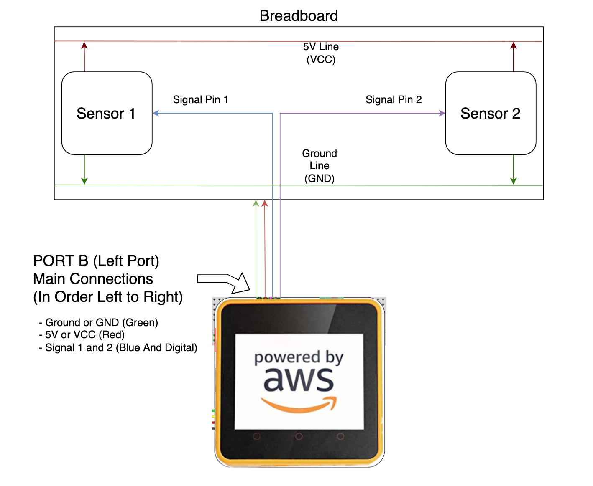
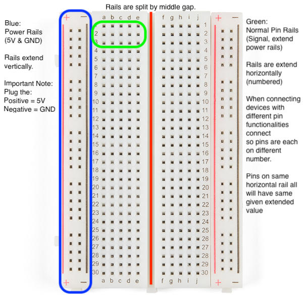
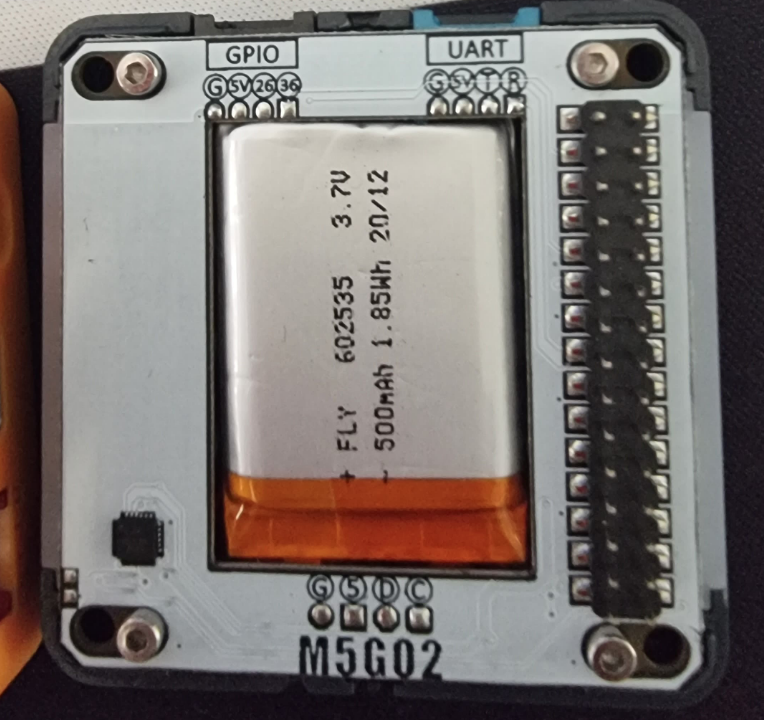

# Hardware Basics

The following outlines important information regarding the usage of various devices required for successful connections and device setup to sensor equipment. This information includes:

- Breadboard layout information
- M5Stack Core 2 Edukit device port layout
- Sample Connection from Edukit to Sensor

****

## General circuit Understanding

- There are three primary connection points that will be sourced from the controlling device. These are:
  - VCC/Power/5V
  - Ground
  - Digital/Analog Signal input pins
- These connections are the foundation for the entire project as they will:
  - Power the devices connected to the Edukit device
  - Allow signals to be sent to and from the sensors to the boards to be used for other purposes
- Think of the Edukit as the parent board which will power all subsequent children devices and obtain and provide relevant data and information
- The flow of electrical energy through devices is seen as positive to negative, and therefore when completing the setup for devices, remember that any connected device must have one port connected to a positive, and one connected to a negative

## Breadboard layout

The breadboard is the primary equipment to assist in connecting devices together in a IoT development environment. The breadboard will allow the main controller device to have it's power connections smoothly passed to the child devices such as sensors, LED's, and other external devices.

The image below highlights the important information for every breadboard:

- The two side rails in blue are considered the power railings
  - The holes extend vertically down the entire side of the breadboard
  - The two sides do not connect unless manually wired together  
  - **The convention is:**
    - **Positive = 5V or VCC**
    - **Negative = Ground or GND**

- The main holes in green are considered the standard connection points
  - The holes extend horizontally until the the break in the middle (the red line)
  - Each row of holes, noted by the number next to each, will represent the same inputted value
    - E.g. If 5V is connected to one of the holes, all hole in that row will have 5V value (this is not limited to only 5V)

- To connect any of the hole connections together, any wire plugged into two different pin hole connections will link them, including over the break gap (red line)

## Edukit/M5 Stack Core 2

The Edukit device is a multipurpose ESP32 development board, repurposed with several inclusive functionalities including:

- LCD Screen (320 x 240)
- I2C Port (Port A)
- General Purpose Input/Output Port (Port B)
- UART Port (Port C)
- Speaker & Microphone
- Vibration Motor

The Edukit is split into two main components:

- Top module:
  - LCD Screen
  - ESP32 Development board itself
  - Pinout etc
- Bottom module:
  - Battery
  - Port Expansions

The main port to be used throughout the development will be **PORT B**. Port B has the following connections shown in the image below:

Port B is the top left port when looking at the device from above/front on. The layout of the port form left to right is:

- Ground (Negative connection)
  
  - The negative port connection to connect to any negative pin for sensors and other devices
  
- 5V (Positive connection)

  - The positive port connection to connecto to any positive pin for sensors and other devices

- 26 & 36
  
  - The General Purpose Input and output ports
  - Used to connect to signal pins of various sensors and devices
  - Pin 26 is a Digital to Analog Converter pin, usually used to read digital signals sent from devices however can be used to read analog readings
  - Pin 36 is a Analog to Digital Converter pin, usually used to read analog signals sent from devices however can still be used to read digital readings

The provided grove cable colours refer to the following ports:

- Black = Ground or GND
- Red = 5V or VCC
- White = PIN 26 or Digital Signal
- Yellow = PIN 36 or Analog Signal

## Base example

- Go through connecting temp humidity with them
- Remeber to connect posi and negi to rail
- Place sensor somewhere on breadboard, vertically
- Now connect pins to requisie lines (posi, negi, and signal)
- How to load code from one of code bases

- DIAGRAM OF WHOLE CONNECTIONS